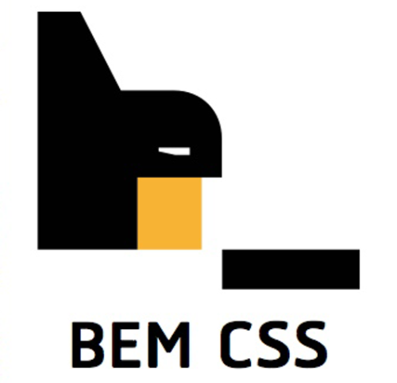

# dio-instagram-home-challenge
 Doing the Challenge to Create Instagram's Home Page

## REFERENCES

#### BEMCSS

You can know how to do _Better CSS's_ project implementetions wiht [BEM CSS](https://getbem.com/).

#### Babel

See Babel documentation to set the TypeScript Web Transpiler in [Babel.IO](https://babeljs.io/).

#### Webpack

See Babel documentation to set the TypeScript Web Transpiler in [Webpack JS](http://webpack.js.org/).